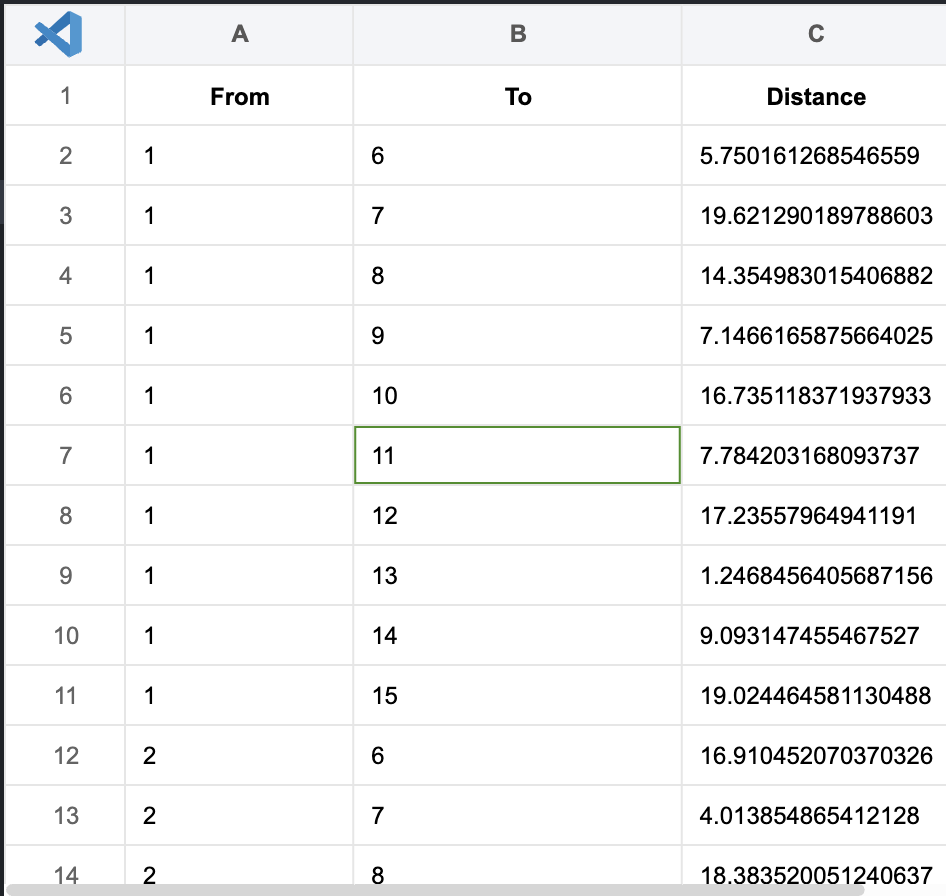
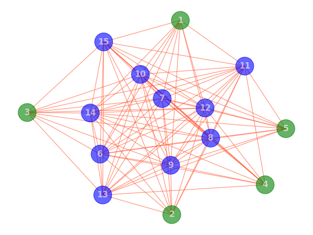
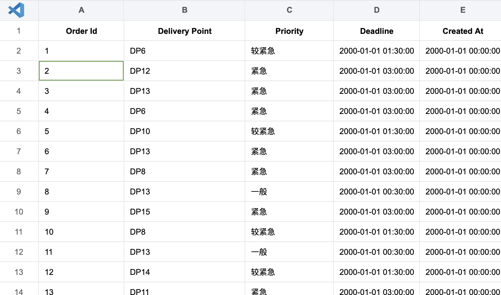
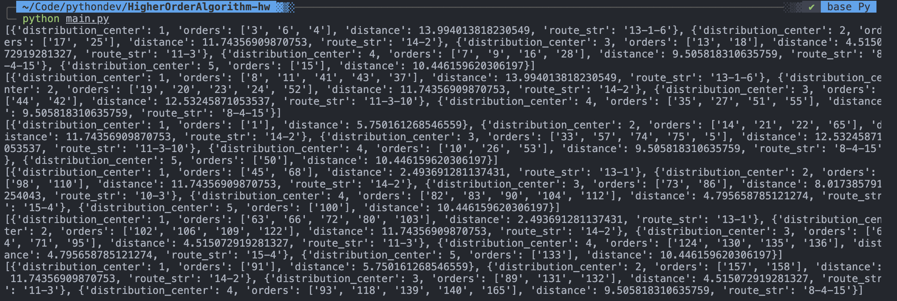

# 无人机配送问题

<!-- @import "[TOC]" {cmd="toc" depthFrom=1 depthTo=6 orderedList=false} -->

<!-- code_chunk_output -->

- [无人机配送问题](#无人机配送问题)
  - [一、问题背景](#一问题背景)
  - [二、数据生成](#二数据生成)
  - [三、问题分析](#三问题分析)
  - [四、求解思路](#四求解思路)
  - [五、代码](#五代码)
    - [模块分析](#模块分析)
    - [求解过程](#求解过程)

<!-- /code_chunk_output -->


## 一、问题背景
无人机可以快速解决最后10公里的配送，本作业要求设计一个算法，实现如下图所示区域的无人机配送的路径规划。在此区域中，共有j个配送中心，任意一个配送中心有用户所需要的商品，其数量无限，同时任一配送中心的无人机数量无限。该区域同时有k个卸货点（无人机只需要将货物放到相应的卸货点即可），假设每个卸货点会随机生成订单，一个订单只有一个商品，但这些订单有优先级别，分为三个优先级别（用户下订单时，会选择优先级别，优先级别高的付费高）：
- 一般：3小时内配送到即可；
- 较紧急：1.5小时内配送到；
- 紧急：0.5小时内配送到。

我们将时间离散化，也就是每隔t分钟，所有的卸货点会生成订单（0-m个订单），同时每隔t分钟，系统要做成决策，包括：
1. 哪些配送中心出动多少无人机完成哪些订单；
2. 每个无人机的路径规划，即先完成那个订单，再完成哪个订单，...，最后返回原来的配送中心；
注意：系统做决策时，可以不对当前的某些订单进行配送，因为当前某些订单可能紧急程度不高，可以累积后和后面的订单一起配送。

目标：一段时间内（如一天），所有无人机的总配送路径最短
约束条件：满足订单的优先级别要求

假设条件：
1. 无人机一次最多只能携带n个物品；
2. 无人机一次飞行最远路程为20公里（无人机送完货后需要返回配送点）；
3. 无人机的速度为60公里/小时；
4. 配送中心的无人机数量无限；
5. 任意一个配送中心都能满足用户的订货需求；
## 二、数据生成
```bash
# 安装依赖
pip install -r requirements.txt
# 生成图数据
python gen_data.py
# 生成图
python gen_graph.py
# 生成订单数据
python gen_order.py
```
图数据的格式如下所示：

图如下所示，假设有五个配送中心（DC），十个卸货点（DP）

订单数据如下所示，包含订单的优先级，订单来自于哪个卸货点等

## 三、问题分析
首先对问题进行分析，可以明白，该问题是一个车辆路径问题，并且是带时间窗和优先级的配送问题，问题的复杂性在于以下几点：
- **多配送中心**：存在多个配送中心，无人机可以从任何一个中心出发。
- **时间窗约束**：每个订单都有特定的送达时间要求，无人机需要在规定时间内完成配送。
- **优先级约束**：订单根据紧急程度分为不同的优先级，需要优先处理高优先级的订单。
- 容量限制：无人机一次最多只能携带一定数量的商品。
- 距离限制：无人机的飞行距离有最大限制。
- 速度限制：无人机有固定的飞行速度。
处理该问题，需要考虑多个约束条件和优化目标，并且需要动态地处理订单生成和配送决策。
通常，我们只能采用一些启发式算法来求得近似解，而不能求得全局下的最优解。
## 四、求解思路
对于本题我采用一些近似策略来对候选路径集合进行修剪，同时，对于每一个时间段内的订单采用贪心策略进行求解，算法流程如下：
1. 对于当前时间内的订单进行分级，优先级高的订单必须在当前时间处理，优先级中低的订单选择性的处理（采用一个参数来控制单位时间段内处理的中低优先级订单个数）
2. 对于一个订单，优先采用离它最近的中心出动无人机进行配送（如果该无人机可以配送）
3. 合并同一条路线上的订单，并根据无人机的载重进行负载均衡，保证出动尽可能少的无人机进行飞行
4. 对于候选路线，按照路径长度进行汇总并排序，选出候选集中的最优路径
## 五、代码
### 模块分析
```python
class Solver:
    """已省略非重点模块"""

    def calculate_distance(self, point1, point2):
        return self.dist_matrix[point1][point2]

    def get_orders(self):
        """
        读取下一个时间内的订单
        """
        if self.current_time in self.order_group:
            self.current_orders.extend(self.order_group[self.current_time])

    def sort_orders_by_priority(self):
        """
        对当前的订单优先级进行排序
        """
        self.current_orders.sort(key=lambda x: x.get("priority", float("inf")))

    def plan_route(self):
        """
        规划无人机的配送路线，目标是最小化总配送路径长度。
        """
        routes = []
        routes.extend(self.handle_urgent_orders())
        routes.extend(self.handle_non_urgent_orders())
        routes = self.aggregate_routes(routes)
        print(routes)
        self.routes.append(routes)

    def handle_urgent_orders(self):
        urgent_orders = [
            order for order in self.current_orders if order["Priority"] == 1
        ]
        if not urgent_orders:
            return

        # 为每个紧急订单分配最近的配送中心
        routes = []
        for order in urgent_orders:
            route = self.assign_route_to_orders(order)
            routes.append(route)
            # 从当前订单列表中移除已处理的订单
            self.current_orders.remove(order)
        return routes

    def find_dp_index(self, delivery_point):
        return int(delivery_point[2:]) - 1

    def assign_route_to_orders(self, order):
        closest_dc = self.find_closest_distribution_center(order["Delivery Point"])
        route = self.create_route_for_order(closest_dc, order)
        return route

    def calculate_route_distance(self, route_str):
        """
        根据route_str和距离矩阵计算总距离。
        """
        total_distance = 0
        points = route_str.split("-")
        for i in range(1, len(points)):
            from_point = int(points[i - 1])
            to_point = int(points[i])
            total_distance += self.dist_matrix[from_point - 1][to_point - 1]
        return total_distance * 2

    def aggregate_routes(self, routes):
        """
        聚合路线，尽量合并起始点相同的路线以减少总配送距离。
        """
        # 按路线的起始配送中心和总距离对路线进行排序，优先合并距离较短的路线
        routes.sort(key=lambda x: (x["distribution_center"], x["distance"]))

        def format_route(route):
            # 使用集合来存储已经添加的配送点索引，避免重复
            added_points = set()
            unique_points = []

            for point in route:
                if point[1] == "end" and point[0] not in added_points:
                    added_points.add(point[0])
                    unique_points.append(str(point[0]))

            # 将去重后的配送点索引连接成字符串，使用"-"作为分隔符
            return "-".join(unique_points)

        # 创建一个字典来保存合并后的路线，键为配送中心索引，值为路线列表
        aggregated_routes = {}
        for route in routes:
            dc = route["distribution_center"]
            if dc not in aggregated_routes:
                aggregated_routes[dc] = []
            aggregated_routes[dc].append(route)

        # 遍历聚合字典，合并同一配送中心的路线
        for dc, routes in aggregated_routes.items():
            if len(routes) > 1:
                # 尝试合并同一配送中心的路线
                merged_route = routes[0]
                for i in range(1, len(routes)):
                    current_route = routes[i]
                    if self.can_merge_routes(merged_route, current_route):
                        last_dp = (
                            merged_route["route"][-1][0]
                            if merged_route["route"]
                            else None
                        )
                        if last_dp:
                            merged_route["route"].append(
                                (current_route["route"][0][0], "end")
                            )
                            merged_route["orders"].extend(current_route["orders"])
                            merged_route["route"].extend(current_route["route"][1:])
                        else:
                            merged_route["route"] = current_route["route"]
                        merged_route["route_str"] = format_route(merged_route["route"])
                        merged_route["distance"] = self.calculate_route_distance(
                            merged_route["route_str"]
                        )
                    else:
                        # 如果不能合并，将当前路线作为新的起始路线
                        merged_route = current_route

                aggregated_routes[dc] = [merged_route]

        # 将聚合后的路线转换为列表
        final_routes = []
        for routes in aggregated_routes.values():
            final_routes.extend(routes)
        for route in final_routes:
            del route["route"]
        return final_routes

    def can_merge_routes(self, route1, route2):
        """
        检查两条路线是否可以合并，基于简单的距离和载重考虑。
        """
        # 检查无人机的载重限制和最大飞行距离
        max_capacity = MAX_CAPACITY  # 假设无人机的最大载重量为5
        total_capacity_needed = len(route1["orders"]) + len(route2["orders"])
        max_flight_distance = 20  # 无人机的最大飞行距离
        total_distance = route1["distance"] + route2["distance"]
        if (
            total_capacity_needed <= max_capacity
            and total_distance <= max_flight_distance
        ):
            return True
        return False

    def handle_non_urgent_orders(self):
        """
        处理非紧急和较紧急的订单，按照最大处理订单数限制。
        """
        non_urgent_orders = [
            order
            for order in self.current_orders
            if order["Priority"] in ("较紧急", "一般")
        ]
        routes = []
        selected_orders = (
            non_urgent_orders[:10] if len(non_urgent_orders) > 10 else non_urgent_orders
        )
        for order in selected_orders:
            route = self.assign_route_to_orders(order)
            routes.append(route)
        return routes

    def find_closest_distribution_center(self, delivery_point):
        """
        找到最近的配送中心。
        """
        # 实现逻辑来找到最近的配送中心
        min_distance = float("inf")
        closest_dc_index = None
        for dc_index in range(NUM_DC):
            dp_index = self.find_dp_index(delivery_point)
            distance = self.calculate_distance(dc_index, dp_index)
            if distance < min_distance:
                min_distance = distance
                closest_dc_index = dc_index
        return closest_dc_index

    def create_route_for_order(self, dc_index, order):
        """
        为单个订单创建配送路线。
        """
        dp_index = self.find_dp_index(order["Delivery Point"])
        route = {
            "distribution_center": dc_index + 1,
            "orders": [order["Order Id"]],
            "distance": self.calculate_distance(dc_index, dp_index),
            "route": [
                (dc_index + 1, "start"),
                (dp_index + 1, "end"),
            ],
        }
        return route

    def solve(self):
        simulation_duration = DURATION_TIME  # 持续时间为24小时，单位为分钟
        simulation_end_time = self.current_time + timedelta(minutes=simulation_duration)
        while self.current_time < simulation_end_time:
            self.get_orders()
            self.sort_orders_by_priority()
            self.plan_route()
            self.__increment_time()
            self.__update_orders()

    def __update_orders(self):
        """
        更新剩余订单的优先级，根据订单的截止时间与当前时间的差距。
        """
        current_time = self.current_time
        for order in self.current_orders:
            time_to_deadline = (order["Deadline"] - current_time).total_seconds() / 60
            if time_to_deadline <= 30:  # 假设30分钟内为高优先级
                order["Priority"] = 1
            elif time_to_deadline <= 60:  # 60分钟内为中等优先级
                order["Priority"] = 2
```
该代码中，主要流程是一个循环，也就是solve函数，首先会获取当前时间内的订单，然后对他们进行排序，然后运行plan_route()函数来对路径进行规划，并对剩余未订单的优先级进行调整。
对于订单的处理策略上，主要是将订单分为了紧急和非紧急（一般和较紧急），对于紧急订单则必须处理。
### 求解过程
```bash
# 运行求解代码
python main.py
```
求解结果如下图所示：

可以看到生成了多条路径，每条路径上标注了距离以及对应的订单id、配送中心等信息。